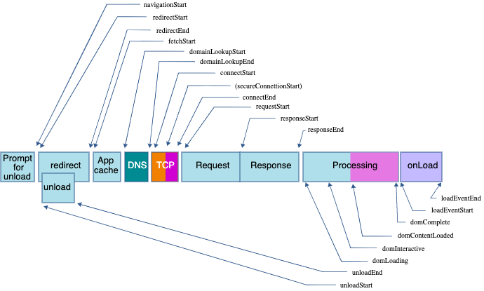
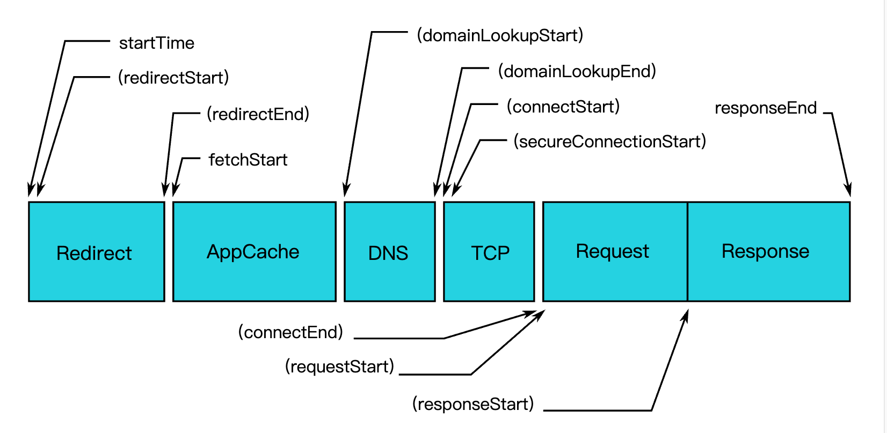

# XMonitor

一个轻量级的前端性能监控插件

性能监控参数大致分为两个部分，页面时间，资源时间。

## 页面时间

https://w3c.github.io/navigation-timing/



```
{
  "connectEnd": 64.15495765894057,
  "connectStart": 64.15495765894057,
  "domainLookupEnd": 64.15495765894057,
  "domainLookupStart": 64.15495765894057,
  "domComplete": 2002.5385066728431,
  "domContentLoadedEventEnd": 2001.7384263440083,
  "domContentLoadedEventStart": 2001.2386167400286,
  "domInteractive": 1988.638474368076,
  "domLoading": 271.75174283737226,
  "duration": 2002.9385468372606,
  "entryType": "navigation",
  "fetchStart": 64.15495765894057,
  "loadEventEnd": 2002.9385468372606,
  "loadEventStart": 2002.7383663540235,
  "name": "document",
  "navigationStart": 0,
  "redirectCount": 0,
  "redirectEnd": 0,
  "redirectStart": 0,
  "requestStart": 65.28225608537441,
  "responseEnd": 1988.283025689508,
  "responseStart": 271.75174283737226,
  "startTime": 0,
  "type": "navigate",
  "unloadEventEnd": 0,
  "unloadEventStart": 0,
  "workerStart": 0.9636893776343863
}
```

由于页面重定向，页面卸载等时间对日常分析开发作用不大，因此这里采用fetchStart作为统计起点，而不是navigationStart。

下面是上报的一些指标：

1. 首字节时间(ttfbTime)： responseStart - fetchStart  (返回子一个字节的时间，可以考察网络后端的整体响应耗时)
2. dns查询时间(dnsTime):  domainLookupEnd - domainLookupStart
3. tcp连接耗时(tcpTime):  connectEnd - connectStart
4. request请求耗时(reqTime): responseEnd - responseStart
5. 解析dom树耗时(analysisTime): domComplete - domInteractive
6. 白屏时间(blankTime)：domInteractive - fetchStart  （用户看到页面展示出现第一个元素的时间）
7. 首屏时间(domReadyTime)：domContentLoadedEventEnd - fetchStart


## 资源时间

https://www.w3.org/TR/resource-timing-2/



```
{
    connectEnd: 263.92999998643063
    connectStart: 263.92999998643063
    decodedBodySize: 51284
    domainLookupEnd: 263.92999998643063
    domainLookupStart: 263.92999998643063
    duration: 15.554999990854412
    encodedBodySize: 8264
    entryType: "resource"
    fetchStart: 263.92999998643063
    initiatorType: "link"
    name: "https://b-gold-cdn.xitu.io/ionicons/2.0.1/css/ionicons.min.css"
    nextHopProtocol: "h2"
    redirectEnd: 0
    redirectStart: 0
    requestStart: 278.070000000298
    responseEnd: 279.48499997728504
    responseStart: 278.3950000011828
    secureConnectionStart: 0
    serverTiming: []
    startTime: 263.92999998643063
    transferSize: 0
    workerStart: 0
}
```

这里我们按照资源类型对不同的资源进行整合，按资源类别进行分类，每一类中，我们采集如下指标：

1. type: 资源类型
2. loadTime:  加载时间,  duration（responseEnd-startTime）
3. name: 资源名称
4. encodedBodySize：资源压缩前大小。
5. decodedBodySize：资源压缩后大小。


## 数据上报

上报时机：页面加载完成
上报方式：默认使用img标签发送get请求，同时支持自定义接口上报。


## 使用方法：

```javascript
XMonitor.init(config, callback);
```

config: object,  
```
{
    url: string, 数据上报地址，这里设置为后端一张图片的地址，上报时，会将所有参数转为json字符串，再进行encode，作为queryparam
         拼接再url后面，格式如下：http://XXXX/XXX.png?param=XXXX, 后端在收到请求后，返回一张1*1的图片即可。
    timeout: number, 单位毫秒。设置资源超时阈值，设置该值则只上报超时的资源
    appId: string，区分不同的项目
}
```

callback: function, 传递该值，则表示自行上报;
参数：
```
data = {
    appId: XXX
    pageTime: {
        analysisTime: 22,
        blankTime: 1912,
        dnsTime: 0,
        domReadyTime: 1912,
        reqTime: 4,
        tcpTime: 0,
        ttfbTime: 15
    },
    resourceTime:[
        img: [
                decodedBodySize: 0,
                encodedBodySize: 0,
                loadTime: 128,
                name: "https://ss3.bdstatic.com/70cFv8Sh_Q1YnxGkpoWK1HF6hhy/it/u=1352352491,2589003526&fm=26&gp=0.jpg",
                type: "img"
            ]       
        link: [
                decodedBodySize: 71752,
                encodedBodySize: 4833,
                loadTime: 1858,
                name: "https://cdnjs.cloudflare.com/ajax/libs/animate.css/4.0.0/animate.min.css",
                type: "link"    
               ]
         ...         
        }
       
    ]
}
```


